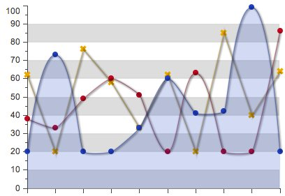
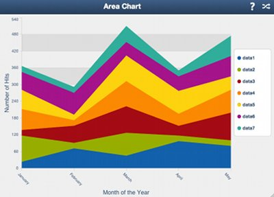
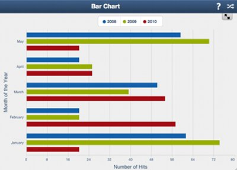
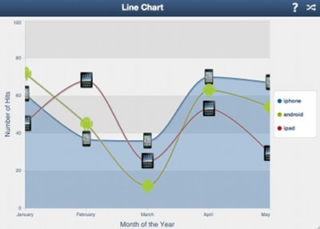
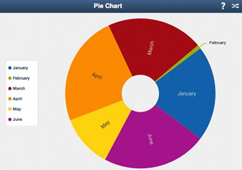
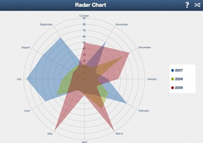
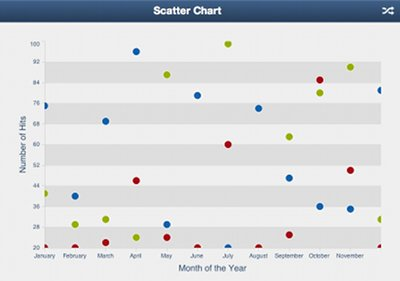
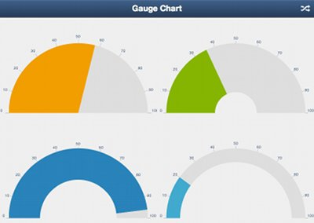

# Touch Charts: Drawing and Charting
______________________________________________

<iframe src="http://player.vimeo.com/video/17673342?byline=0&amp;portrait=0" width="500" height="281" frameborder="0"></iframe>

This document is intended to guide you through the overall design and implementation details
of the Drawing and Charting packages for Sencha Touch. The drawing and charting packages enable you to create
cross browser and cross device graphics in a versatile way.

The structure of this document will cover three main topics:

- Section I: "Draw" a versatile cross-browser/device package to draw general purpose
graphics and animations.
- Section II: "Chart" A high level presentation of the charting package and how classes are
organized in it.
- Section III: "Series" A presentation of the available series and their use.

## I. The Draw Package
______________________

The design choices in the graphics team concerning drawing were not just constrained to charting:
we needed a versatile tool that would enable us to create custom graphics in a cross-browser/device manner and also perform rich animations with them.
With mobile devices in mind, Sencha Touch charts would have to be
focused on performance, small footprint and rich interactions.

The Draw package contains a Surface class that abstracts the underlying graphics implementation
and enables the developer to create arbitrarily shaped Sprites or SpriteGroups that respond to
interactions like touch events (tap, swipe, etc.) and also provide rich animations on all style attributes like shape, color, size,
etc.

The underlying/concrete implementation for the Surface class is a 2D Canvas engine. We discovered that on most mobile devices procedural drawing with the
2D Canvas API outperformed DOM based approaches like SVG. Also,
since one of our goals was to be fully compatible with Android devices,
(and not all of them support SVG), Canvas was the best approach.

### Creating a Drawing Surface

You can create a simple drawing surface without loading the Charting package at all. This can be useful
to create arbitrary graphics that work on all devices and animate well. For example, you could
create an interactive map of the United States where each state is a sprite, or also an infographic where
each element is also a sprite. What's interesting about using sprites and not images is that the document
acquires a new level of interactivity, having Sprites support all
possible touch and mobile based events creates a richer end user
experience.

In order to use the Draw package directly you can create a Draw Component and (for example) append it to an `Ext.Panel`.
In order to do that you could create an HTML file containing the Sencha
Touch and Charts frameworks and point to an `index.js` file:

        <!DOCTYPE html>
        <html>
        <head>
            <meta http-equiv="Content-Type" content="text/html; charset=utf-8">
            <meta name="viewport" content="width=device-width; initial-scale=1.0; maximum-scale=1.0; minimum-scale=1.0; user-scalable=0;" />
            <link rel="stylesheet" href="../../resources/css/touch-charts-demo.css" type="text/css">

            <title>My Graphic</title>
            
            
            
        </head>
        <body></body>
        </html>

Then, in the JavaScript `index.js` file pointed by the HTML file you
could add this code:

        Ext.setup({
          onReady: function() {
            //create draw component with a yellow circle in it
            var drawComponent = new Ext.draw.Component({
              items: [{
                type: 'circle',
                fill: '#ffc',
                radius: 100,
                x: 100,
                y: 100
              }]
            });

            //add the component to the panel
            new Ext.chart.Panel({
              fullscreen: true,
              title: 'Yellow Circle',
              items: drawComponent
            });

            //make sure we render the image
            drawComponent.surface.renderFrame();
          }
        });

In this case we created a draw component and added a sprite to it. The *type* of the sprite is *circle* so if you run this code
you'll see a yellow-ish circle in a Panel.

Sprites can have different types. Some of them are:

 - *circle* - To draw circles. You can set the radius by using the *radius* parameter in the sprite configuration.
 - *rect* - To render rectangles. You can set the width and height of the rectangle by using the *width* and *height* parameters
 in the sprite configuration.
 - *text* - To render text as a sprite. You can set the font/font-size by using the *font* parameter.
 - *path* - The most powerful sprite type. With it you can create arbitrary shapes by using the [SVG path syntax](http://www.w3.org/TR/SVG/paths.html).
You can find a quick tutorial on to how to get started with
the path syntax [here](https://developer.mozilla.org/en/SVG/Tutorial/Paths).

A Sprite is an object rendered in a Drawing surface. There are different options and types of sprites.
The configuration of a Sprite is an object with the following properties:

- **type** - (String) The type of the sprite. Possible options are 'circle', 'path', 'rect', 'text', 'square'.
- **width** - (Number) Used in rectangle sprites, the width of the rectangle.
- **height** - (Number) Used in rectangle sprites, the height of the rectangle.
- **size** - (Number) Used in square sprites, the dimension of the square.
- **radius** - (Number) Used in circle sprites, the radius of the circle.
- **x** - (Number) The position along the x-axis.
- **y** - (Number) The position along the y-axis.
- **path** - (Array) Used in path sprites, the path of the sprite written in SVG-like path syntax.
- **opacity** - (Number) The opacity of the sprite.
- **fill** - (String) The fill color.
- **stroke** - (String) The stroke color.
- **stroke-width** - (Number) The width of the stroke.
- **font** - (String) Used with text type sprites. The full font description. Uses the same syntax as the CSS `font` parameter.
- **text** - (String) Used with text type sprites. The text itself.

Additionally there are three transform objects that can be set with `setAttributes` which are `translate`, `rotate` and
`scale`.

For translate, the configuration object contains x and y attributes for the translation. For example:

    sprite.setAttributes({
      translate: {
       x: 10,
       y: 10
      }
    }, true);

For rotate, the configuration object contains x and y attributes for the center of the rotation (which are optional),
and a degrees attribute that specifies the rotation in degrees. For example:

    sprite.setAttributes({
      rotate: {
       degrees: 90
      }
    }, true);

For scale, the configuration object contains x and y attributes for the x-axis and y-axis scaling. For example:

    sprite.setAttributes({
      scale: {
       x: 10,
       y: 3
      }
    }, true);

### Interacting with a Sprite

Now that we've created a draw surface with a sprite in it, let's dive into how to interact with the sprite.
We can get a handle to the sprite we want to modify by adding that sprite imperatively to the surface:

    // Create a draw component
    var drawComponent = new Ext.draw.Component();

    // Add the component to the panel
    new Ext.chart.Panel({
      fullscreen: true,
      title: 'Yellow Circle',
      items: drawComponent
    });

    // Add a circle sprite
    var myCircle = drawComponent.surface.add({
        type: 'circle',
        x: 100,
        y: 100,
        radius: 100,
        fill: '#cc5'
    });

    // Now do stuff with the sprite, like changing its properties:
    myCircle.setAttributes({
        fill: '#ccc'
    }, true);

    // Remember always to refresh the image
    drawComponent.surface.renderFrame();

    // or animate an attribute on the sprite
    // no need to refresh the image when adding animations.
    myCircle.animate({
        to: {
            fill: '#555'
        },
        duration: 2000
    });

    // Add a touch listener to the sprite
    myCircle.addListener('touchstart', function() {
        alert('touchstarted!');
    });

In this example we've seen how we can add events, set sprite attributes and animate these attributes using the
draw package. As you can see this package is a versatile abstraction layer over the graphics we can do. What's
most interesting about this class is that we aren't tied to a specific shape or structure; also all elements
support events, setting attributes and creating animations. Most
important of all, all of this is compatible in most devices.

## II. Charts

So now that we learnt about the expressive power of the draw package, let's dive into charts. The chart
package consists of a hierarchy of classes that define a chart container (something like a surface but more specific for
handling charts); axes, legends, series, labels, callouts, tips, cartesian and radial coordinates, and specific series
like Pie, Area, Bar, etc.

In this section we will cover how these classes are tied together and what bits of functionality go into each of these
classes. We won't cover each particular series, since that is done in the next section.

### Chart

The Chart class is the main drawing surface for series. It manages the rendering of each series and also how axes are
drawn and defined. Chart also delegates touch events over to different areas of the Chart like Series, Axes, etc.
The Chart class extends Draw Component.

A Chart instance has access to:

 - axes - Accessed through `chart.axes`. All the axes being defined and drawn for this visualization. This is a mixed collection.
 - series - Accessed through `chart.series`. All the series being drawn for the chart. This could be line, bar, scatter, etc. This is also a mixed collection.
 - legend - The legend box object and its legend items.

The chart instance supports custom events that can be triggered right before and during the rendering of the visualization.
We can add handlers for these events by using:

    chart.on({
      'refresh': function() {
        alert('(re)drawing the chart');
      }
    });

### Legend

The chart configuration object accepts a `legend` parameter to enable legend items for each series and
to set the position of the legend. These options are passed into the constructor of the chart. For example:

    var chart = new Ext.chart.Chart({
        width: 200,
        height: 200,

        // Set a legend
        legend: {
            position: {
                portrait: 'bottom',
                landscape: 'left'
            },
            font: '20px Arial'
        },

        // Define axes
        axes: [/*set an axis configuration*/],

        // Define series
        series: [/*set series configuration*/]
    });

Each series object needs to have the `showInLegend` parameter set to `true` in order to be in the legend list. Also, legend positioning
differs depending on the orientation of the device. For portrait, the legend object will be positioned at the bottom of the
chart, for landscape the legend will be at the left. This is useful
since most of the time we'll be rendering charts on a contrained space.

### Axis

The `axis` package contains an `Abstract` axis class that is extended by `Axis` and `Radial` axes. `Axis` represents
a `Cartesian` axis and `Radial` uses polar coordinates to represent the information for polar based visualizations like
Pie, Gauge and Radar series. Axes are bound to the type of data we're trying to represent. There are axes for categorical
information (called `Category` axis) and also axis for quantitative information like `Numeric`. For time-based information
we have the `Time` axis that enables us to render information over a specific period of time, and to update that period of time
with smooth animations. If you'd like to know more about each axis please go to the axis package documentation. Also, you will find
configuration examples for axis in the bottom series examples.

An axis contains divisions and subdivisions of values, represented by major and minor ticks. These can be adjusted automatically
or manually to some specified interval, maximum and minimum values. The configuration options `maximum`, `minimum`, `majorTickSteps` and
`minorTickSteps` in the `Numeric` axis are used to change the configuration and placement of the major and minor ticks. For example, by
using:

            axes: [{
                type: 'Numeric',
                position: 'left',
                fields: ['data1'],
                title: 'Number of Hits',
                minimum: 0,
                //one minor tick between two major ticks
                minorTickSteps: 1
            }, {
                type: 'Category',
                position: 'bottom',
                fields: ['name'],
                title: 'Month of the Year'
            }]

The following configuration will produce minor ticks in the left axis
for the line series:

### Gradients

The drawing and charting package has also the power to create
linear gradients. The gradients can be defined in the Chart configuration
object as an array of gradient configurations. For each gradient configuration
the following parameters are specified:

 * **id** - string - The unique name of the gradient.
 * **angle** - number, optional - The angle of the gradient in degrees.
 * **stops** - object - An object with numbers as keys (from 0 to 100) and style objects as values.

Each key in the stops object represents the percentage of the fill on the specified color for
the gradient.

For example:

        gradients: [{
            id: 'gradientId',
            angle: 45,
            stops: {
                0: {
                    color: '#555'
                },
                100: {
                    color: '#ddd'
                }
            }
        },  {
            id: 'gradientId2',
            angle: 0,
            stops: {
                0: {
                    color: '#590'
                },
                20: {
                    color: '#599'
                },
                100: {
                    color: '#ddd'
                }
            }
        }]

You can apply a gradient to a sprite by setting a reference to a gradient **id** in
the fill property. This reference is done via a url syntax. For example:

        sprite.setAttributes({
            fill: 'url(#gradientId)'
        }, true);

You can also set a gradient object directly in the `setAttributes`
method:

        sprite.setAttributes({
            fill: {
                id: 'gradientId',
                angle: 45,
                stops: {
                    0: {
                        color: '#555'
                    },
                    100: {
                        color: '#ddd'
                    }
                }
            }
        }, true);

## III. Series List

A `Series` is an abstract class extended by concrete visualizations like
`Line` or `Scatter`. The `Series` class contains code that is common to all of these series, like event handling, animation
handling, shadows, gradients, common offsets, etc. The `Series` class is enhanced with a set of *mixins* that provide functionality
like highlighting, callouts, tips, etc. A `Series` will contain an array of `items` where each item contains information about the
positioning of each element, its associated `sprite` and a `storeItem`. The series also share the `drawSeries` method that updates
all positions for the series elements and then renders them.

The following section will go through our available series/visualizations, introduce each
one of them and show a complete configuration example of the series. The example will include the `Chart`,
`Axis` and `Series` configuration options.

### Area

Creates a Stacked Area Chart. The stacked area chart is useful when displaying multiple aggregated layers of information.
As with all other series, the Area Series must be appended in the *series* Chart array configuration.

A typical configuration object for the area series could be:

        //Create a chart panel.
        new Ext.chart.Panel({
          fullscreen: true,
          title: 'Area Chart',
          dockedItems: [{
            xtype: 'button',
            iconCls: 'help',
            iconMask: true,
            ui: 'plain',
            handler: onHelpTap
          }, {
            xtype: 'button',
            iconCls: 'shuffle',
            iconMask: true,
            ui: 'plain',
            handler: onRefreshTap
          }],
          //Chart class configuration
          items: {
            cls: 'area1',
            theme: 'Demo',
            store: store1,
            animate: true,
            //set legend positioning on landscape and
            //portrait orientations
            legend: {
              position: {
                portrait: 'bottom',
                landscape: 'right'
              },
              labelFont: '20px Arial'
            },
            //define x and y-axis configuration.
            axes: [{
              type: 'Numeric',
              position: 'left',
              fields: ['data1', 'data2', 'data3', 'data4', 'data5', 'data6', 'data7'],
              title: 'Number of Hits',
              minimum: 0,
              adjustMinimumByMajorUnit: 0
            }, {
              type: 'Category',
              position: 'bottom',
              fields: ['name'],
              title: 'Month of the Year'
            }],
            //create the actual area series
            series: [{
              type: 'area',
              highlight: false,
              axis: 'left',
              xField: 'name',
              yField: ['data1', 'data2', 'data3', 'data4', 'data5', 'data6', 'data7']
            }]
          }
        });

### Bar

Creates a Bar Chart. A Bar Chart is a useful visualization technique to display quantitative information for different
categories that can show some progression (or regression) in the dataset.
As with all other series, the Bar Series must be appended in the *series* Chart array configuration. See the Chart
documentation for more information.

A typical configuration object for the bar series could be:

    //create a chart panel
    var chartPanel = new Ext.chart.Panel({
      title: 'Bar Chart',
      fullscreen: true,
      //append the chart configuration in the panel.
      items: {
        //set a className to the component.
        cls: 'bar1',
        //link the component to a stylesheet.
        theme: 'Demo',
        //bind the store to a chart.
        store: store1,
        //turn on animation and shadows.
        animate: true,
        shadow: false,
        //set legend configuration
        legend: {
          position: {
            portrait: 'right',
            landscape: 'top'
          },
          labelFont: '17px Arial'
        },
        //set some interactions like reset on double tap
        //and pan/zoom on the axes.
        interactions: [{
          type: 'reset'
        }, {
          type: 'togglestacked'
        }, {
          type: 'panzoom',
          axes: {
            left: {}
          }
        }],
        //define the x and y-axis configuration.
        axes: [{
          type: 'Numeric',
          position: 'bottom',
          fields: ['2008', '2009', '2010'],
          label: {
            renderer: function(v) {
              return v.toFixed(0);
            }
          },
          title: 'Number of Hits',
          minimum: 0
        }, {
          type: 'Category',
          position: 'left',
          fields: ['name'],
          title: 'Month of the Year'
        }],
        //define the actual bar series.
        series: [{
          type: 'bar',
          xField: 'name',
          yField: ['2008', '2009', '2010'],
          axis: 'bottom',
          highlight: true,
          showInLegend: true
        }]
      }
    });

### Line

Creates a Line Chart. A Line Chart is a useful visualization technique to display quantitative information for different
categories or other real values (as opposed to the bar chart), that can show some progression (or regression) in the dataset.
As with all other series, the Line Series must be appended in the *series* Chart array configuration. See the Chart
documentation for more information.

A typical configuration object for the line series could be:

    //create a new panel for the line chart
    new Ext.chart.Panel({
      title: 'Line Chart',
      fullscreen: true,
      //define the actual chart class
      items: {
        cls: 'line1',
        //link the chart to a stylesheet.
        theme: 'Demo',
        store: store1,
        //animate and display shadows.
        animate: true,
        shadow: true,
        //define legend configuration.
        legend: {
          position: 'right'
        },
        //define x and y-axis.
        axes: [{
          type: 'Numeric',
          minimum: 0,
          maximum: 100,
          position: 'left',
          fields: ['Series 1', 'Series 2'],
          title: 'Number of Hits',
          minorTickSteps: 1
        }, {
          type: 'Category',
          position: 'bottom',
          fields: ['name'],
          title: 'Month of the Year'
        }],
        //define the actual series.
        //two line series will be displayed.
        series: [{
          type: 'line',
          //highlight config
          //to be set when we interact
          //with the chart.
          highlight: {
            size: 7,
            radius: 7
          },
          fill: true,
          smooth: true,
          axis: 'left',
          xField: 'name',
          yField: 'data1'
        }, {
          type: 'line',
          highlight: {
            size: 7,
            radius: 7
          },
          axis: 'left',
          smooth: true,
          xField: 'name',
          yField: 'data2'
        }]
      }
    });

### Pie

Creates a Pie Chart. A Pie Chart is a useful visualization technique to display quantitative information for different
categories that also have a meaning as a whole, for example, all 12
months of a given year.
As with all other series, the Pie Series must be appended in the *series* Chart array configuration. See the Chart
documentation for more information. A typical configuration object for the pie series could be:

A typical configuration object for the pie series could be:

    //create a panel to put the chart in
    var chartPanel = new Ext.chart.Panel({
      title: 'Pie Chart',
      fullscreen: true,
      //define the actual chart class.
      items: {
        cls: 'pie1',
        //bind the chart to a stylesheet
        theme: 'Demo',
        store: store1,
        shadow: false,
        animate: true,
        //set padding for the top, bottom and left parts
        //of the chart.
        insetPadding: {
          top: 20,
          bottom: 20,
          left: 10
        },
        //configure the legend.
        legend: {
          position: {
            portrait: 'bottom',
            landscape: 'left'
          },
          labelFont: '17px Helvetica, Arial, sans-serif' // To be moved to SCSS
        },
        //describe the actual pie series.
        series: [{
          type: 'pie',
          field: '2007',
          //set as donut chart.
          donut: 25,
          showInLegend: true,
          highlight: false,
          //when labels overflow the pie slice, set to use a callout.
          listeners: {
            'labelOverflow': function(label, item) {
              item.useCallout = true;
            }
          },
          //set the callouts configuration
          callouts: {
            //this method gets called each time a callout is placed.
            renderer: function(callout, storeItem) {
              callout.label.setAttributes({
                text: storeItem.get('name')
              }, true);
            },
            //for each element, this function decides wether to create a
            //callout for it or not.
            filter: function() {
              return false;
            },
            //styling of the callout sprites, the callout box, lines and
            //label.
            box: {
              //no config here.
            },
            lines: {
              'stroke-width': 2,
              offsetFromViz: 20
            },
            label: {
              font: 'italic 20px Arial'
            },
            styles: {
              font: '14px Arial'
            }
          },
          label: {
            field: 'name'
          }
        }]
      }
    });

### Radar

Creates a Radar Chart. A Radar Chart is a useful visualization technique for comparing different quantitative values for
a constrained number of categories.
As with all other series, the Radar series must be appended in the *series* Chart array configuration. See the Chart
documentation for more information.

A typical configuration object for the radar series could be:

    //create a panel to put the chart in.
    new Ext.chart.Panel({
      title: 'Radar Chart',
      fullscreen: true,
      items: {
        cls: 'radar1',
        theme: 'Demo',
        //set some padding in the chart.
        insetPadding: 30,
        //enable shadows and animations.
        shadow: true,
        animate: true,
        store: store1,
        //set rotation and double tap reset interactions.
        interactions: ['rotate', 'reset'],
        //style the legend.
        legend: {
          position: {
            portrait: 'bottom',
            landscape: 'right'
          },
          labelFont: '17px Helvetica, Arial, sans-serif' // To be moved to SCSS
        },
        //define a radial axis for the radar chart.
        axes: [{
          type: 'Radial',
          position: 'radial',
          label: {
            display: true
          }
        }],
        //define three diferent series for the radar chart.
        series: [{
          showInLegend: true,
          type: 'radar',
          xField: 'name',
          yField: '2007'
        },{
          showInLegend: true,
          type: 'radar',
          xField: 'name',
          yField: '2008'
        },{
          showInLegend: true,
          type: 'radar',
          xField: 'name',
          yField: '2009'
        }]
      }
    });

### Scatter

Creates a Scatter Chart. The scatter plot is useful when trying to display more than two variables in the same visualization.
These variables can be mapped into x, y coordinates and also to an element's radius/size, color, etc.
As with all other series, the Scatter Series must be appended in the *series* Chart array configuration. See the Chart
documentation for more information on creating charts.

A typical configuration object for the scatter series could be:

        //create a panel to add the chart in.
        new Ext.chart.Panel({
            title: 'Scatter Chart',
            fullscreen: true,
            items: {
                cls: 'scatter1',
                theme: 'Demo',
                animate: false,
                store: store1,
                //define the axes.
                axes: [{
                    type: 'Numeric',
                    position: 'left',
                    fields: ['data1', 'data2', 'data3'],
                    title: 'Number of Hits'
                }, {
                    type: 'Category',
                    position: 'bottom',
                    fields: ['name'],
                    title: 'Month of the Year'
                }],
                //describe three different scatter series.
                series: [{
                    type: 'scatter',
                    markerConfig: {},
                    axis: 'left',
                    xField: 'name',
                    yField: 'data1'
                }, {
                    type: 'scatter',
                    markerConfig: {},
                    axis: 'left',
                    xField: 'name',
                    yField: 'data2'
                }, {
                    type: 'scatter',
                    markerConfig: {},
                    axis: 'left',
                    xField: 'name',
                    yField: 'data3'
                }]
            }
        });

### Gauge

Creates a Gauge Chart. Gauge Charts are used to show progress in a certain variable. There are two ways of using the Gauge chart.
One is setting a store element into the Gauge and selecting the field to be used from that store. Another one is instantiating the
 visualization and using the `setValue` method to adjust the value you want.

A chart/series configuration for the Gauge visualization could look like this:

                  {
                    animate: true,
                    store: store1,
                    //define a gauge axis.
                    axes: [{
                        type: 'gauge',
                        position: 'gauge',
                        minimum: 0,
                        maximum: 100,
                        steps: 10,
                        margin: 7
                    }],
                    //define a two-colored gauge series.
                    series: [{
                        type: 'gauge',
                        field: 'data2',
                        donut: 30,
                        colorSet: ['#82B525', '#ddd']
                    }]
                  }

In this configuration we create a special Gauge axis to be used with the gauge visualization (describing half-circle markers), and also we're
setting a maximum, minimum and steps configuration options into the axis. The Gauge series configuration contains the store field to be bound to
the visual display and the color set to be used with the visualization.

