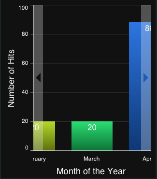

# Touch Charts: Interactions
______________________________________________

This guide introduces the advanced interaction features in Sencha Touch Charts. By taking advantage
of these features, you can create highly interactive charts that allow your users to visualize and
easily navigate complex data sets.

## Introduction

Deploying web-based charts on mobile touch devices poses some unique problems over desktop environments:

- Small screen sizes limit the amount and complexity of data that you can display at once.
- Accurately selecting data points in order to get detailed information is difficult with touch input.
- Hardware limitations make redrawing chart data very expensive.

While designing Sencha Touch Charts, we realized that these unique issues would make the sort of
charts commonly seen on the Web practically unusable on touch devices. It became clear that a
great user experience would require a greatly expanded level of interactivity beyond anything seen
in current charting products, that the interactions would have to be highly configurable,
and that they would all have to be carefully designed to perform well on limited mobile hardware.

The result is a comprehensive set of interactions included in Sencha Touch Charts 1.0, each one
completely optional and highly configurable.

______________________________________________

## Adding Interactions to Your Chart

To add one or more interactions to your chart, simply set the `interactions` config of the chart to an
array of interaction config objects. Each object must contain a `type` property matching one of the supported
interaction types, which are described below in the Supported Interaction Types section. Each object may also
contain additional configuration options appropriate for that particular interaction.

For example:

    var myChart = new Ext.chart.Chart({
        store: myStore,
        series: [{
            type: 'column',
            xField: 'month',
            yField: ['visitors', 'pageviews']
        }],
        legend: {
            position: 'left'
        },
        interactions: [
            {
                type: 'panzoom',
                axes: ['bottom']
            },
            {
                type: 'togglestacked',
                gesture: 'taphold'
            },
            {
                type: 'reset'
            }
        ]
    });

This column chart will be configured with three interactions: `panzoom` to allow zooming and panning along
the bottom axis, `togglestacked` to switch between stacked and grouped columns on taphold, and `reset` to let the user
reset everything back to its default state.

When adding an interaction with no additional configuration beyond its `type`, you can opt to specify that
type as a simple String value rather than in an Object. So the above example could alternatively be written as:

    var myChart = new Ext.chart.Chart({
        ...
        interactions: [
            {
                type: 'panzoom',
                axes: ['bottom']
            },
            {
                type: 'togglestacked',
                gesture: 'taphold'
            },
            'reset'  // no custom config, just give the type
        ]
    });

### Gestures

All of the supported interactions are bound by default to gestures that make sense in most situations,
however it is possible that you will want to change which gestures trigger which interactions on a case-by-case
basis. This is particularly likely when combining interactions whose default gestures collide with one another,
such as the `itemhighlight` and `iteminfo` interactions which are both bound to a `tap` gesture by default.

To allow customization of the gestures, each interaction exposes one or more gesture config properties. For simple
interactions with a single gesture, such as `reset` or `iteminfo`, use the `gesture` config:

    interactions: [{
        type: 'iteminfo',
        gesture: 'taphold' //changed to use taphold instead of the default tap gesture
    }]

More complex interactions which use more than a single gesture expose multiple `fooGesture` configs for
customizing each. See the API documentation for each interaction class to see which gesture properties it supports.

______________________________________________

## Supported Interaction Types

This section describes all of the supported interactions included with Touch Charts 1.0.

### Reset

The `reset` interaction allows the end user to reset all other interactions back to their original untouched
state. It is bound to `doubletap` by default but that can be customized with the `gesture` config. An optional
confirmation dialog can be presented to the user before resetting if the `confirm` config is set to true.

#### Example:

    interactions: [{
        type: 'reset',
        gesture: 'taphold',
        confirm: true
    }]

This interaction is implemented by the Ext.chart.interactions.Reset class; see that class's API documentation for
detailed configuration options.

### Item Highlighting

The `itemhighlight` interaction allows the user to highlight individual data point items on the chart. It is
bound to `tap` by default but that can be customized with the `gesture` config.

The exact presentation of the highlighting effect varies by series type; for instance bar series items highlight
by gaining a border and lightening in color, while pie series items highlight by sliding out. The highlight
effects can also be customized via the `highlight` config property on each series.

#### Example:

    interactions: [{
        type: 'itemhighlight',
        gesture: 'tap'
    }]

This interaction is implemented by the Ext.chart.interactions.ItemHighlight class; see that class's API
documentation for detailed configuration options.

### Item Info

The `iteminfo` interaction allows the user to select an individual data point item on the chart and be given
detailed information about that item in a popup panel. It is bound to `tap` by default but that can be
customized with the `gesture` config.

The popup panel that gets displayed to the user does not have any default content, as that content is highly
dependent on the particular data model and chart configuration being used. You must therefore implement a
handler for the interaction's `show` event to populate the panel. The handler will be passed a reference to
the interaction instance, the item selected by the user, and the panel instance.

#### Example:

    interactions: [{
        type: 'iteminfo',
        gesture: 'taphold',
        listeners: {
            show: function(interaction, item, panel) {
                var record = item.storeItem;
                panel.update(
                    '<b>Traffic in ' + item.get('month') + ':</b>' +
                    '<ul>' +
                        '<li>Visitors: ' + item.get('visitors') + '</li>' +
                        '<li>Page Views: ' + item.get('pageviews') + '</li>' +
                    '</ul>'
                );
            }
        }
    }]

This interaction is implemented by the Ext.chart.interactions.ItemInfo class; see that class's API
documentation for detailed configuration options.

### Item Comparison

The `itemcompare` interaction is similar to `iteminfo`, but allows the user to select two data point items
instead of just one and be given detailed information about the two items in relation to each other. An arrow
will be displayed connecting the two items being compared. Selection of each item is bound to `tap` by default
but that can be customized with the `gesture` config.

By default only the connecting arrow will be displayed when two data point items are selected. You will
likely want to implement a custom handler for the `show` event to present the user with detailed info about
the trend between items. The handler function will be passed a reference to the interaction instance, from
which you can retrieve the `item1` and `item2` properties.

#### Example:

    interactions: [{
        type: 'itemcompare',
        listeners: {
            show: function(interaction) {
                var val1 = interaction.item1.value,
                    val2 = interaction.item2.value;
                Ext.Msg.alert(
                    'Trend',
                    'Trend from ' + val1[0] + ' to ' + val2[0] + ': ' +
                        Math.round((val2[1] - val1[1]) / val1[1] * 100) + '%',
                    interaction.reset,
                    interaction
                );
            }
        }
    }]

This interaction is implemented by the Ext.chart.interactions.ItemCompare class; see that class's API
documentation for detailed configuration options.

### Axis Pan/Zoom Navigation

The `panzoom` interaction allows the user to navigate one or more axes in a cartesian chart by zooming in/out
and panning around. This is particularly useful for series with large numbers of data points; zooming in lets
the user see details and more easily interact with individual data points.

On devices which support multi-touch events, a two-touch pinch gesture performs a zoom and a single-touch drag
performs a pan. In non-multi-touch environments a single-touch drag is used to perform both zoom and pan; a
small toggle button will be added to the edge of the chart which allows the user to switch between zooming and
panning modes.

This interaction must be bound to one or more axes; parameters for the pan/zoom can be configured individually
per axis. For details see the API docs for the `axes` config property.

#### Example:

    interactions: [{
        type: 'panzoom',
        axes: {
            bottom: {
                maxZoom: 4
            }
        }
    }]

 

This interaction is implemented by the Ext.chart.interactions.PanZoom class; see that class's API
documentation for detailed configuration options.

### Pie/Radar Rotation

The `rotate` interaction allows the user to rotate a pie or radar chart. By default rotation is performed via
the `drag` gesture; this can be changed to `pinch` to require a two-finger pinch-and-twist gesture, however
be aware that not all touch devices support multiple-touch events.

#### Example:

    interactions: [{
        type: 'rotate'
    }]

This interaction is implemented by the Ext.chart.interactions.Rotate class; see that class's API
documentation for detailed configuration options.

### Pie Grouping

The `piegrouping` interaction allows the user to select multiple consecutive slices in a pie series and be
shown detailed information about the selected group of items. Selection is begun by tapping a single slice
(the exact gesture can be changed via the `gesture` config) which displays a selection overlay, and then the
user can drag the handles on either edge of the overlay to extend the selection to other slices.

By default this interaction does not do anything when the selection is modified; instead it fires a
`selectionchange` event for which you can add a listener that displays detailed information about the
selection to the user.

#### Example:

    interactions: [{
        type: 'piegrouping',
        listeners: {
            selectionchange: function(interaction, selectedItems) {
                var sum = 0,
                    i = selectedItems.length;
                if (i) {
                    while(i--) {
                        sum += selectedItems[i].storeItem.get('visitors');
                    }
                    chartPanel.descriptionPanel.setTitle('Total visitors: ' + sum);
                    chartPanel.headerPanel.setActiveItem(1, {type: 'slide', direction: 'left'});
                }
                else {
                    chartPanel.headerPanel.setActiveItem(0, {type: 'slide', direction: 'right'});
                }
            }
        }
    }]

This interaction is implemented by the Ext.chart.interactions.PieGrouping class; see that class's API
documentation for detailed configuration options.

### Toggle Stacked Bar/Column

The `togglestacked` interaction applies only to Bar or Column series which have multiple `yField` values.
Normally these series display the yFields as multiple bars grouped together side-by-side, but they can also
be configured as `stacked` which displays them stacked on top of one another. Both visualizations have their
own advantage for the user: the normal grouped orientation makes it easy to see exact values and compare them
relative to one another, but the stacked orientation makes it easy to see a total sum. By attaching the
`togglestacked` interaction, the user is able to switch between these two states on the fly.

By default this interaction is bound to a `swipe` event, but that can be customized with the `gesture` config.

#### Example:

    interactions: [{
        type: 'togglestacked',
        gesture: 'doubletap'
    }]

 

This interaction is implemented by the Ext.chart.interactions.ToggleStacked class; see that class's API
documentation for detailed configuration options.

______________________________________________

## Legend Interactions

While not technically "interactions" in the API sense, the chart legend also exposes some useful ways for
the user to interact with the chart data. These are enabled automatically when a legend is configured for
the chart, and they do not need to be individually configured.

### Hiding

The user is able to tap on any item in the legend to toggle it to and from hidden state. This is useful
for charts with many series, allowing the user to remove certain items that get in the way.

 

### Combination

For series that add multiple legend items, such as Bar/Column and Pie series, the user can tap-hold one
of the legend items and drag-drop it on top of another item from the same series; this combines those
two items so they will be displayed as a single item in the series. Double-tapping a combined item
splits it back into its original constituent items.

 
