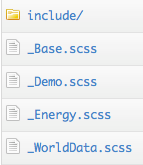

# Touch Charts: Styling

This guide describes the styling system used in Touch Charts, and provides an overview of how you can
customize the look and feel of your charts to truly make them yours.

## Introduction ##

An important part of customizing Charts is the design aspect. For styling charts, the graphics and design
team decided to adopt a [SASS](http://sass-lang.com/) based approach.

SASS styling is only applied to HTML elements, so how do we make this approach available in Charts?

Styling charts in a CSS/SASS declarative way was harder to implement than styling other components of a
Sencha Touch application, since the underlying implementation of charts is not an HTML based one. As
described in a previous document, the Sencha Touch Charts default rendering engine is the Canvas 2D context,
and in Canvas there's no intrinsic notion of a DOM element (or any notion of element at all). However, the
design and styling of charts is something more related to a designer's perspective than to an engineer's,
and a designer should not worry or even be aware of the underlying implementation of a Chart to style it.

This decoupling of styling and functionality lead us to think of an easy approach for designers to customize
charts. This problem had already been solved in Sencha Touch before by using SASS-based styling of apps, and
so we decided to take that very same format and include it as a sort of DSL inside of SASS for styling Charts.
The result is quite interesting: it provides fully stylable charts while maintaining decoupling and also
blending in nicely with the Sencha Touch philosophy of styling.

We provide an extension of elements to SASS/CSS, including elements like `chart`, `series`, `axis`, `marker`
and providing most of the CSS functionality like querying by id, (i.e. `chart#mychart`), property
(i.e. `axis[position=right]`), descendants (i.e. `series label`), pseudo-selectors (i.e. `series:nth-child(1)`), etc.

Under the hood a `.scss` file is compiled into a JavaScript object that contains information for each rule on
the selector, style and specificity of this rule to apply styling in a coherent order to each chart component.
We then use {@link Ext.ComponentQuery} to query all the elements that make a chart (`chart`, `series`, `axis`,
`label`, `marker`, `title`, etc.) and apply the styles to those elements by applying the style object to its
style properties. The generated JavaScript descriptor object from the `.scss` files can be found in the
`ThemeList.js` source file, and the script that takes care, at runtime, to apply all these properties to
the different chart components is `Theme.js`. You will find more information on the workflow and also on
how things work under-the-hood in the following sections.

Note that even though we provide an extension to SASS for styling charts, you should be aware that not all
CSS style rules behave the same (or even work) in an `.scss` file. We added support for some CSS properties,
but we have some custom properties that are specific to charting. We provide example style sheets for the
demos and sample applications we created (Energy App, World Data), so you can get a grasp of what is possible
with the new styling in Sencha Touch Charts.

Below you'll find information on how to get started creating your own theme, and also specific information
on the styling `scss` language and elements.

## Creating a Custom Theme ##

Now that we've seen how themes are implemented and why using SASS based theming is an improvement over other
styling approaches, let's dive into creating our own custom theme.

There are two different ways in which themes can be customized: we can change variables/colors in an existing
theme to customize the color palette and other parameters of an existing design scheme; or  we can create a new
theme from scratch, overriding parameters from the base theme and adding our own custom selectors and attributes
for charts.

For both approaches we will need to know where the style files are and how they get converted in style rules to
be applied into charts. The `scss` resources folder can be found in `charts/resources/sass/chart-themes`, where
`charts` is the root touch charts framework folder.

Inside the `chart-themes` folder you'll find a `_Base.scss` file as well as other themes used in the examples
packages with the framework. For example, `_WorldData.scss` is used in the World Data exmaple and `_Energy.scss`
is used in the US energy data visualization. The `_Base.scss` file is always included and all styles are applied
for the chart. These are the default styles for the chart, the ones you would see when you create a chart but
don't add any styling either in the constructor configuration object or in other stylesheets. The `_Base.scss`
file uses variables for colors and other design configurations that are included via `include/variables`.

These variables are:

- `$font-family` - The overall font family for the charts. This font is used in axes labels, series labels,
  axes titles, tooltips, etc. Default is `Helvetica, Arial, sans-serif`.
- `$chart-blue` - Defines the blue palette for the charts. Default is `#115fa6`.
- `$chart-green` - Defines the green palette for the charts. Default is `#94ae0a`.
- `$chart-red` - Defines the red palette for the charts. Default is `#a61120`.
- `$chart-orange` - Defines the orange palette for the charts. Default is `#ff8809`.
- `$chart-yellow` - Defines the blue palette for the charts. Default is `#ffd13e`.
- `$chart-purple` - Defines the blue palette for the charts. Default is `#a61187`.
- `$chart-teal` - Defines the blue palette for the charts. Default is `#24ad9a`.
- `$chart-grey` - Defines the blue palette for the charts. Default is `#7c7474`.
- `$chart-brown` - Defines the blue palette for the charts. Default is `#a66111`.
- `$charts-active-color` - General color used in the interactions for highlighting elements or render visual
  aids. Default is `hsla(hue($active-color), saturation($active-color), 50, 1)`.
- `$pie-grouping-color` - The color used in the pie grouping interaction. This color is also used in other
  pie specific interactions. Default is the same as `$charts-active-color`.
- `$axis-stroke-color` - The stroke color for the axes. Default is `#ccc`.
- `$text-color` - The base color for the text. Default is `#666`.
- `$title-color` - The base color for the title text of the charts. Default is `#333`.
- `$default-fill-alpha` - The default fill opacity value. Default is 1.
- `$default-stroke-alpha` - The default stroke opacity value. Default is 1.

You can change either of these variables and the base theme will be changed accordingly. For the changes to take
effect though, you will need to rebuild the library by calling `build-touch-charts.sh` if you're in Mac OS X or
`build-touch-charts.bat` if you're in Windows.

The `build-touch-charts` script will iterate through all `.scss` files in `charts/resources/sass/chart-themes`
and will generate a `ThemeList.js` file in `charts/src/chart/theme` that will contain a JavaScript descriptor
object with the information of the css selectors used and the style object defined for each selector. Then the
library will be built, compressed, and all JavaScript files (including the new descriptor object for the chart
themes) will be concatenated into an updated touch-charts build.

Changing the value for some of these variables and rebuilding the framework will show the new theme colors
applied to the charts.

If you'd like to create a new theme from scratch then you can create a `_MyTheme.scss` file in
`charts/resources/sass/chart-themes` and define your own styles and colors for the charts there. Remember that
when a value is not set for a particular chart component, the styling will be taken from `_Base.scss`. A good
idea would be to start by using `_Base.scss` as a template to start your own stylesheet.

After creating and coding your stylesheet you'll need to do the same build process as described above: run
`build-touch-charts.sh`/`.bat` in order to generate the `ThemeList.js` file and recompile the framework to
include that file in the main code of the framework. In order to specify which stylesheet should be applied
to each chart, in the constructor object when creating the chart you can use the `theme` property to designate
a stylesheet to be used with the chart. For example:

    new Ext.chart.Chart({
      theme: 'MyTheme',
      axes: [/*axes configuration*/],
      series: [/*series configuration*/]
    });

This assigns the `_MyTheme.scss` stylesheet to be used with the created chart and will apply all styles to all
descendant elements within that chart (axes, series, labels, titles, markers, etc).


## SASS Structure ##

To allow ComponentQuery to traverse it for selector matching, the chart theming engine defines a simple
hierarchical tree structure for applying styles. Each level of this hierarchy is treated as an "element"
when matching selectors:

- chart
    - axis
        - grid
        - label
        - title
    - series
        - label
        - marker
    - interaction

Let's examine each of these in detail...

### chart ###

All chart theme styles start with a `chart` selector, indicating they apply to a chart:

    chart {
        /* chart styles */
    }

This selector can also have an attribute predicate added, for instance to only apply certain styles to a chart
with a {@link Ext.chart.Chart#cls cls} of 'mychart':

    chart[cls=mychart] {
        /* chart styles for mychart */
    }

The chart element supports the following properties:

- `background: <color>;` - Defines a solid background color for the entire chart. Defaults to a transparent chart
  background.
- `colors: <color list>;` - Defines a space-separated list of colors that will be used by series such as Pie, Bar, and Column that need to render multiple items with different colors.
- `padding: <number>;` - Defines how much padding appears on each edge of the chart. Supports a CSS-style shorthand
  for the top/right/bottom/left edges. Do not include units. Defaults to `padding: 10;`.

### axis ###

The `axis` child element of the chart defines styles for axis labels, lines, and grids. Use attribute predicates to limit styles to
certain axes:

    chart {
        axis {
            /* common axis styles */
            stroke: #000;
        }

        axis[position=left] {
            /* styles for left axis only */
            stroke: #009;
        }
    }

The direct properties in the axis selector are applied to the Sprite that generates the axis edge line and tick
marks. See {@link Ext.draw.Sprite} for supported properties. The most useful are `stroke` and `stroke-width`.

Within the axis selector, the following sub-selectors are supported:

- `grid` - Contains styles for the axis grid lines. Can contain `even` and `odd` sub-selectors, whose properties
  are applied to the Sprites for the even-numbered and odd-numbered grid sections. If `even` and `odd` are not
  specified, then any direct properties of the `grid` selector will apply to both Sprites.

        chart {
            axis {
                grid {
                    stroke: #CCC; /*applies to both even and odd*/
                    even {
                        fill: #EEE;
                    }
                    odd {
                        fill: #FFF;
                    }
                }
            }
        }

- `label` - Contains styles for the axis tick labels. Properties are applied to the Sprite objects for each
  label; see {@link Ext.draw.Sprite} for supported text sprite properties.

  To support styling of label rotation, a custom `rotate` property is also supported; its value must include the
  x/y origin and the rotation angle in degrees, all space-separated.

        chart {
            axis {
                label {
                    font: 11px Helvetica,sans-serif;
                    rotate: 0 0 270;
                }
            }
        }

- `title` - Contains styles for the axis title. Supports the same properties as `label`.

### series ###

The `series` selector defines styles for items drawn by the chart's series. Use attribute predicates to limit
styles to certain series:

    chart {
        series {
            /* common series styles */
        }

        series[type=line] {
            /* styles for line series only */
        }
    }

The properties in the series selector are applied to the Sprites used to draw the series items.

Within the series selector, the following sub-selectors are supported:

- `label` - Contains styles for the series labels, if any. See the description above about axis labels.

- `marker` - Contains styles for the series markers, if any. Style properties are applied to the Sprite
  object for each label; see {@link Ext.draw.Sprite} for supported properties. The `type` property, if
  present, will be used to select a {@link Ext.chart.Shape shape type}.

Since charts often have more than one series, e.g. multiple line series overlaid on each other, it is useful
to define different colors for each series to help distinguish them. This can be done easily by using the
`nth-child` selector, for example:

    chart {
        series {
            &:nth-child(1) { fill: red; }
            &:nth-child(2) { fill: blue; }
            &:nth-child(3) { fill: green; }
        }
    }

### interaction ###

Some interactions use Sprites for displaying certain aspects of their UI, for instance the
{@link Ext.chart.interactions.ItemCompare itemcompare} interaction displays an arrow connecting the
selected items. These can be styled by targeting `interaction` selectors by type.

The exact sub-selectors and properties vary by interaction type. Currently:

- `interaction[type=itemcompare]` supports `circle`, `line`, and `arrow` sub-selectors, which apply
  their properties to the connector's circle, line, and arrow sprites respectively.

- `interaction[type=piegrouping]` supports `slice` and `handle` sub-selectors, which apply their
  properties to the overlay selection slice and handles respectively.